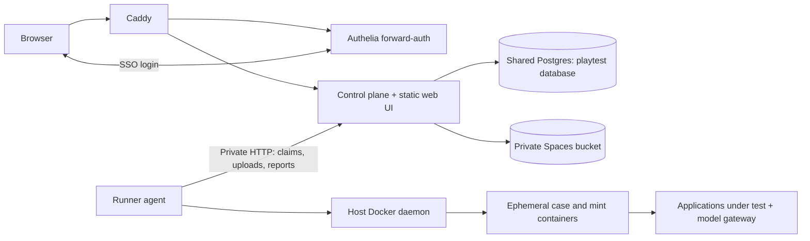

# Hosted Compose deployment

Status: local implementation verified; external acceptance and rollout pending.
Evidence: [acceptance.md](acceptance.md).
Created: 2026-09-05. Build plan: [build_plan.md](build_plan.md).

## Outcome and scope

Run the hosted platform on one Linux VM: one control plane serving the web UI,
one persistent runner agent launching isolated case containers, a tenant database
in the existing shared Postgres instance, and private DigitalOcean Spaces object
storage. Caddy and Authelia provide public entry and verified forwarded identity.

The first milestone is the same application topology running locally through
Docker Compose, with local Postgres and an S3-compatible test service. A second
local profile exercises real Spaces and the production authentication path before
VM rollout. The local CLI and engine remain usable without hosted services.

This item includes the storage port, object lifecycle correctness, runner
packaging, authentication integration, local verification, and reviewable infra
wiring. Creating this backlog does not deploy infrastructure or read secrets.

## Decisions and owner inputs

Owner requirements, 2026-09-05:

- One VM hosts the control plane, web UI, and runners.
- Postgres replaces SQLite for hosted metadata; Spaces holds hosted objects.
- The control plane and UI sit behind the existing Caddy/Authelia setup.
- Follow the deploy-stack workflow for configuration and encrypted secrets.
- Establish local Compose deployment before deploying to DigitalOcean.
- Previous backlog folders were intentionally deleted; do not restore them.

Owner rulings, 2026-09-05:

- “start empty”: create a fresh hosted database and object namespace; leave old
  SQLite data and local objects untouched. No import phase.
- “all admitted users are site admins”: every human admitted by this app's
  Authelia policy receives site-admin capability, with their own audit identity.
- “we can forward the auth, but i dont want to do anything too complicated here
  for now”: use Caddy/Authelia forwarded identity, without a second OIDC login or
  dedicated Playtest OIDC client registration.

Implementation choices made by this design, not owner-specified numbers:

- Postgres is the sole supported hosted database after cutover. Keep filesystem
  object storage for offline adapter tests; do not maintain a second SQL dialect.
- Start with one site-scoped runner, one active group, and a deployment ceiling of
  one concurrent case. More runners require distinct credentials and work roots.
- Use stack `playtest`, proposed host `syd1`, hostname
  `playtest.jeremyvun.com`, HTTP port 4177, and the shared Postgres 18 service.
  These derive from deploy-stack conventions; verify placement at rollout.
- Bucket name, region, endpoint, credentials, Authelia policy, and VM
  resource allocations are deployment inputs. Templates must expose them; no
  guessed bucket or credential belongs in source.

## Starting implementation and intended changes

This table records the pre-build inventory, not the current runtime. The
mechanisms below are now implemented locally; acceptance.md records what has
been verified and which production gates remain. Paths are repository-relative.

| Area | Starting implementation | Implemented change |
|---|---|---|
| Database | `control-plane/src/db.ts` uses `node:sqlite`, schema-derived decoding, one serialized connection, synchronous `Tx.query` | Async Postgres adapter and caller/type audit |
| Schema | `control-plane/migrations/0001_baseline.sql`, `0002_drop_discovery_allowed.sql` use SQLite types/defaults | New Postgres migration lineage representing the current schema |
| SQL | JSON extraction/array functions, integer booleans, SQLite constraint-message matching appear throughout API/dispatch/findings | Port SQL and error handling, including aggregation and null semantics |
| Objects | `store/s3-store.ts` is entirely unimplemented | Real S3 adapter plus endpoint and credential validation |
| Object publication | `api/executor-api.ts` reuses an executor-specific bundle key; failure deletes it | Immutable byte identities; failed publication cannot delete another request's accepted object |
| Blob lifecycle | `api/personas.ts` and suite commits perform object I/O inside transactions; `retention/worker.ts:gcBlobs` checks snapshot references only | Stage outside transactions and protect every reference, including personas |
| Auth | `auth/middleware.ts` supports bearer/session/dev; `api/util.ts:requireSiteAdmin` accepts only dev admin | Real production site-admin principal; verified Authelia integration |
| Runner URLs | `api/executor-api.ts:groupSpec` builds upload URLs from `publicUrl` | Runner transport must remain on the configured runner connection |
| Containers | `runner-agent/src/case-runner.ts` invokes the host Docker CLI and bind-mounts workspace paths | Package runner/job images and make host/runner paths agree |
| Boot | `scripts/hosted-server.sh` builds, optionally reads a local env file, creates a dev key and supervises a dev runner | Immutable image startup with separate Compose services |
| Operations | Retention interval defaults to zero; `index.ts` has no signal drain; no platform `/healthz` | Explicit schedules, readiness, graceful termination, backup/restore |

All abbreviated package paths in this table are under `packages/platform/`.

## Runtime topology

Production `stacks/playtest/docker-compose.yml` owns control-plane and runner
services. Existing infra stacks continue to own Caddy, Authelia, registry, and
Postgres; do not duplicate them. The web package remains built assets served by
the control plane, not another server. This intentionally supersedes the current
instruction to launch the runner through `npm run hosted` rather than as a service.

Networks:

- Control plane: `edge-proxy`, `shared-db`, and a private `playtest-control`
  network. No production host ports.
- Runner: `playtest-control` and outbound network access. It receives no DB,
  Spaces, ingress, or platform encryption credentials.
- Case/mint containers: an explicitly selected job network with outbound access
  and access to test targets. They do not join `shared-db`, `edge-proxy`, or
  `playtest-control`. Local test targets join this job network.
- The runner mounts the Docker socket. It is a trusted VM operator component;
  per-case containers get no socket, runner credential, or platform secrets.
  This is a trusted-owner deployment, not hostile multi-tenant compute.

Public browser/API URLs use `PUBLIC_URL`. Runner clients use
`PLAYTEST_SERVER_URL=http://control-plane:4177`; upload locations become relative
API paths resolved against that client's configured base URL. Keep compatibility
with old absolute templates when reading old server responses, but reject
cross-origin destinations before forwarding bearer tokens. The server must never
derive a trusted upload origin from arbitrary `Host` or forwarding headers.

Caddy gates all browser and ordinary API paths. `/healthz` is a minimal public
exception; `/api/v1/runner/*` is refused on public ingress for this first topology.
Internal runner routes still validate credentials, executor scope, and fencing.
External CI/runners and public token-only automation are deferred; they need an
explicit machine-authenticated ingress route, not an `Authorization`-header bypass.

## Postgres port

Use `pg` as a direct control-plane dependency. `DATABASE_URL` becomes the required
hosted database setting. Invalid/missing configuration or an unreachable database
fails startup; no SQLite or memory fallback. Reject obsolete hosted database-file
configuration with an actionable error. Keep Node's repository-wide version floor.

Preserve the current serialization contract during this port. One owned
`pg.Client` serves all application queries through the existing FIFO gate;
`withTx` retains the gate from `BEGIN` through `COMMIT`/`ROLLBACK`. Nested calls and
stray `db.query` inside a transaction join its client via AsyncLocalStorage.
`Tx.query` and migration execution return promises. This deliberately postpones
query pooling and concurrent transactions: changing storage must not also change
the state-machine and event ordering model.

Acquire a database-scoped Postgres advisory session lock on that same connection
before migrations or bootstrap. A second writer fails with a useful error. Loss
of the connection clears readiness and terminates the process; it must not
reconnect silently without reacquiring ownership. Startup migration and standalone
maintenance commands use the same lock. A standalone migration command cannot
run alongside a live writer. Forward-only numbered SQL files and a checksummed
ledger reject unknown or edited applied migrations. Each file and its ledger row
commit together. No superuser rights or runtime database creation.

Schema mapping:

- IDs remain text ULIDs with deterministic `C` ordering for cursor/index keys.
- `TEXT_JSON` becomes `jsonb`; objects and arrays are explicitly serialized as
  JSON parameters. Do not let node-postgres encode JS arrays as Postgres arrays.
- `INT_BOOL` becomes `boolean`; port `= 0/1`, defaults, checks and JSON predicates.
- `INT_TS` becomes `timestamptz(3)`; JS rows retain `Date` values and HTTP retains ISO
  UTC strings. Convert numeric epoch-ms arguments deliberately at their callers;
  daily buckets stay UTC. Millisecond precision preserves equality after a JS Date
  round trip. Database `now()` provides transaction timestamps and dispatch ages.
- Binary encrypted values become `bytea`. Counts/bigints/numerics have explicit
  safe-number conversion or documented string representation; preserve existing
  API numeric values without a global lossy bigint parser.
- Preserve foreign keys, delete actions, partial unique indexes, finding
  fingerprints, active-dispatch uniqueness, and retry-attempt uniqueness.
- Replace SQLite JSON functions with Postgres expressions and use SQLSTATE plus
  named constraints for conflicts. Preserve missing-value versus JSON-null
  semantics; changing a dialect must not change filters or verdicts.
- Audit sparse/repeated placeholder numbering and excess parameter arrays;
  SQLite's selective binding is not node-postgres's parameter contract. A caught
  SQL error aborts a Postgres transaction until rollback: replace expected
  conflicts with `ON CONFLICT` or use an explicit savepoint before continuing.

Audit every `withTx` body, including helpers it calls: object I/O, model calls,
network calls, and slow bundle work happen before/after the transaction. Recheck
the relevant sequence, lifecycle and ownership when publishing the result.
After-commit callbacks run only after successful commit; rollback emits no event
or wake. Keep the durable feed's bounded rescan. Ensure event IDs remain ordered
after restart/clock rollback by seeding the event generator from persisted event
state before serving; test reconnect cursors across this boundary.

Fresh deployment means a new empty Postgres database. Never automatically delete,
open, or import the owner's old `.playtest-data`. Old hosted SQLite data requires
its old build to inspect; the owner chose no import.

## Spaces adapter and object correctness

Use `@aws-sdk/client-s3`, Signature V4, an explicit endpoint, bucket, region and
credentials, with a bounded request timeout/retry policy. Configure SDK checksum
behavior explicitly for Spaces compatibility and test against Spaces itself;
an emulator is not the compatibility proof. No public ACL, CDN, browser bucket
credentials, or direct browser upload is needed.

Keep the `ObjectStore` byte-oriented operations: `put`, `get`, inclusive
`getRange`, `has`, idempotent `delete`, and `list`. Implement paginated
`ListObjectsV2` to exhaustion. Add a paginated metadata iterator for maintenance
(`key`, `size`, `lastModified`); keep `list` as a compatibility convenience.
Validate keys/prefixes, enforce an installation prefix, and never escape that
namespace. Only genuine missing-object responses become `not_found`/false;
permission failures, timeouts and outages remain errors. Hash actual bytes with
SHA-256; S3 ETags are not the artifact hash. Range reads must verify the returned
range rather than silently accepting an entire object.

Production uses explicit HTTPS regional origin configuration; test endpoints may
use HTTP and path-style addressing. Reserve separate prefixes/buckets for local
testing and production. The app never creates a production bucket on startup.
Startup performs a bounded put/read/range/list/delete probe under its own health
prefix to establish actual object permissions; subsequent readiness probes use
a stable sentinel and cached dependency status, not repeated writes every 15s.

Postgres and S3 have no shared transaction. Publication follows this ordering:

1. Validate and prepare bytes; acquire a shared object-lifecycle guard.
2. Write complete bytes under an immutable key containing their content hash
   (and run/executor identity where applicable). Never overwrite published bytes.
3. In a short database transaction, revalidate ownership/sequence and publish the
   key, size and hash with its projections, audit and event.
4. Release the lifecycle guard. Failed/conflicting publication leaves collectible
   bytes; it does not eagerly delete a key another request may have published.

Apply this to suites, personas, bundles, live staging, retention rewrites, clips
and captions. Live staging retains its budget reservations and ready state.
Retries of identical bytes are idempotent; conflicting retries cannot repaint
sealed evidence. Bundle/report hash and size checks remain authoritative.

Physical deletion uses the exclusive side of the same in-process lifecycle guard
and rechecks references immediately before deletion. It is separate from the DB
query gate: never hold a database transaction while waiting for object I/O.
All reference publishers acquire the shared guard before a DB transaction; GC
acquires the exclusive guard before its short reference query, establishing one
lock order. Bound and batch GC so it cannot starve uploads. The singleton writer
restriction is essential to this mechanism; adding another control plane would
require a distributed publication/GC protocol.

GC must consider snapshots, current suite-file rows, project personas, artifacts,
live reservations, and every other persisted object reference found in the schema
inventory. Build one reference enumerator reused by GC, backup and verification.
P0 source audit (2026-09-05): current suite-file rows store inline content, so
protect matching blob hashes derived from those bytes. Baselines and candidates
also own bundle keys through `trajectory_key` (`<key>#<entry>`); enumerate those
independently of artifact rows. Live trajectory text and manifests are inline
database content. See [inventory.md](inventory.md) for the complete mapping.
Objects abandoned by a crash are collected only after a configured grace period
(draft default 24 hours), with no unknown-age deletion. Bucket lifecycle rules
must not independently expire current evidence that Playtest has pinned.

Keep the existing 512 MiB sealed-bundle ceiling. The current reader buffers whole
bundles and can retain one above its nominal cache budget; remote storage does not
make this memory free. Bound heavy upload/read/clip concurrency and account for
multiple buffers plus cache and temporary rewritten bundles. Large-bundle and
concurrent viewer tests determine the minimum control-plane memory limit before
VM placement. Streaming/direct-to-S3 redesign is outside this item unless those
tests show the existing ceiling cannot be served on the chosen VM.

## Authentication and bootstrap

Use `PLAYTEST_AUTH=proxy`. Caddy performs Authelia forward-auth on every public
browser/API request, removes client-supplied `Remote-*` and
`X-Playtest-Proxy-Key` headers first, copies verified `Remote-User`, `Remote-Email`
and `Remote-Name`, then injects `X-Playtest-Proxy-Key` from a generated stable
`PLAYTEST_PROXY_SECRET`. Playtest accepts forwarded identity only when this key
matches in constant time and Remote-User is a single nonempty bounded value.
Duplicate/malformed headers fail closed. No host port exposes the control plane.
The generated key is shared only by trusted ingress configuration and the control
plane; runner/job services receive none. This protects the private runner network
from becoming an alternate header-authenticated human entrypoint.

Use a namespaced subject derived from Remote-User; preserve the user's own id in
audit rows, update display metadata, and reject disabled users. Every accepted
proxy user has `isSiteAdmin`; bearer tokens and runner credentials retain their
scoped authority and never inherit forwarded user privileges. Proxy mode ignores
Playtest session cookies: Authelia admission is rechecked on each request.
Apply same-origin checks to every proxy-authenticated browser write, including
logout; browser cookies are held by Authelia, so a Playtest cookie is not required
for this CSRF check. Missing Origin/Referer on a browser-authenticated write fails.

Login returns to a validated local path after ingress admission. Logout redirects
to the explicitly configured Authelia logout URL, clearing any legacy Playtest
cookie. Production parity uses real Authelia and verifies deep links, logout,
revocation, spoofed headers, disabled users and direct-ingress rejection. Default
local Compose may use dev auth. Existing OIDC mode is outside this deployment's
scope; its ID-token validation audit remains deferred and it is not used as the
production authentication path for this build.

Project guards, project listing and site-runner administration consistently
recognize `isSiteAdmin` separately from development auth. VM configuration rejects
`PLAYTEST_AUTH=dev`. No OIDC client secret or callback registration is needed.

Bootstrap the initial site runner without an unauthenticated enrollment route:
an explicit server bootstrap config takes a stable name and credential delivered
through encrypted deployment secrets. On a fresh DB it creates the hashed
credential row and an audited system registration. On restart it verifies the
same live row; it does not rotate automatically or resurrect a revoked runner.
A mismatch/revocation fails readiness with instructions to reconcile config or
register a new identity. Scope is explicitly site-wide. The runner reads the
credential from a mode-0600 file created from its environment by the entrypoint;
never put it in argv, logs or a response during unattended bootstrap.

## Runner and image packaging

Build three targets from the same source revision and lockfile:

- `playtest-control-plane`: Node 24.18+, TypeScript sources/workspace packages,
  built platform UI plus embedded viewer, ffmpeg with required filters/fonts.
- `playtest-runner`: Node, runner source, Docker CLI, and required core modules.
- `playtest-job`: Node, core/runner child entry at the existing
  `/opt/playtest/packages/platform/runner-agent/src/case-runner-child.ts`, pinned
  Playwright Chromium and system libraries, ffmpeg and fonts.

Use `npm ci` and build browser assets during image build; no install, browser
download or Vite build on container startup. Exclude env files, secrets, old data,
runs and workstation artifacts via `.dockerignore`. Bake publishes linux/amd64
images for the VM and supports native local builds. Pin all three images to the
same release; preflight/pull the job image before runner readiness. Do not rely
on an unqualified `playtest-job:latest` existing on the host.

The agent invokes the host daemon, so bind sources refer to the Docker host, not
the agent container. Mount the runner work directory at the same absolute path
on both sides, supplied by `PLAYTEST_RUNNER_WORKDIR`; local helper computes a
workspace-local absolute directory, production uses an explicit host directory.
Fail preflight if a probe job cannot read/write the expected mounted workspace.
Case/mint containers mount only their own directory. Give them explicit job
network, non-root ownership, memory/CPU/PID limits and adequate `/dev/shm`.
No privileged mode and no Docker socket in case/mint containers. Hosted nested
Compose targets are outside the initial supported profile.

Add runner-level total/record concurrency ceilings applied as minima against the
suite/project policy. Initial Compose defaults are total=1, record=1. Resource
budget must include control-plane peak buffers, runner buffers/workspace disk,
one case's limit, shared Postgres, Caddy/Authelia and the VM's other workloads.
Do not infer a VM size from the existing project default of 10 total/3 recording.

Label spawned containers/networks with installation, runner and executor identity.
Janitor cleanup uses these labels, not global `playtest-*` name matching. On
restart, fence/reconcile a stale attempt before removing its surviving container;
never delete another runner's active work. Shutdown stops claims, cancels/drains
active cases using existing fencing, then exits within Compose's stop grace.
Claimed work lost to VM failure may become infrastructure failure; completed,
verified evidence is durable. Resuming an in-flight browser is not promised.

The VM profile supports web/API execution. iOS still requires an external macOS
runner; Android emulator/device hosting is not added by this item.

## Configuration and secrets

Follow `/Users/jeremy/projects/projects/README.md` and deploy-stack. Infra receives
committed `config.env`, a commented empty `secrets.env.example`, and sealed
`secrets.env.age`; plaintext `secrets.env` stays local, mode 0600. Operators enter
Spaces values locally. Agents never read an env file without permission.
Compose explicitly injects only each service's needed keys, guards required values
with `${VAR:?message}`, and never renders resolved configuration into logs.

| Configuration | Class | Recipient |
|---|---|---|
| `POSTGRES_USER`, `POSTGRES_DB`, DB hostname/port, TLS policy | Non-secret | Control plane / backup tooling |
| `POSTGRES_PASSWORD` → encoded `DATABASE_URL` | Secret | Control plane / backup tooling; mirrored as `PLAYTEST_DB_PASSWORD` in shared Postgres provisioning |
| `OBJECT_STORE_URL`, `OBJECT_STORE_BUCKET`, `OBJECT_STORE_REGION`, new prefix/path-style options | Non-secret | Control plane |
| `OBJECT_STORE_ACCESS_KEY`, `OBJECT_STORE_SECRET_KEY` | Secret | Control plane; separate backup credentials where needed |
| `PLAYTEST_KMS_KEY` | Secret; stable 32-byte encryption/signing key | Control plane; preserve separately for restore |
| `PLAYTEST_AUTH`, `PUBLIC_URL`, Authelia logout URL | Non-secret | Control plane |
| `PLAYTEST_PROXY_SECRET` | Generated secret | Control plane / Caddy ingress configuration |
| Initial runner name/labels, `PLAYTEST_SERVER_URL`, workdir, job image/network/limits | Non-secret | Respective server bootstrap and runner |
| Initial site-runner credential | Secret | Control plane bootstrap and that runner only |
| `PLAYTEST_LLM_BASE_URL`, model choices | Non-secret, unless URL embeds credentials (reject that form) | Control plane / runner / job as needed |
| `PLAYTEST_LLM_API_KEY` | Secret | Only components making model calls |
| Retention/reconciliation intervals, cache and resource limits | Non-secret | Respective service |

The build adds a complete per-image environment inventory to the operator guide,
including retained optional knobs. Do not pass the entire merged infra env to
all containers. Assemble DB URLs with proper password encoding, or use structured
PG connection settings; generated hex passwords also avoid interpolation hazards.
Do not generate a new KMS key on VM boot. Changing it cannot decrypt old secrets;
key rotation with ciphertext migration is separate work.

## Local deployment and operations

Add a root Compose definition and explicit helper commands. A clean local start
requires Docker, builds the images, starts Postgres and a pinned S3-compatible
test service, provisions a private test bucket, migrates and starts the control
plane, registers the local runner and starts it. Publish the UI only on host
loopback. Test-service credentials are disposable and cannot be used by the VM
profile. The helper creates local development credentials without printing them
and supplies them explicitly; it never sources an existing repository `.env`.

The default local profile may use dev auth; the production-parity profile uses
Authelia forwarded identity and a real Spaces test prefix. The default
profile still uses Postgres and the S3 adapter. `npm run hosted` becomes a documented
alias for local Compose, with direct control-plane/runner commands retained for
development against explicitly configured dependencies. Update current startup
instructions and repository boundary tests together.

`GET /healthz` returns only minimal liveness, unauthenticated. `GET /readyz` is
internal and reports 200 only after ownership lock, migrations, web assets,
bootstrap, and storage probe succeed, and while dependency checks remain healthy.
Compose/deployctl gates on readiness; Caddy's external check uses `/healthz`.
Runner health verifies polling progress, Docker connectivity and job image access;
it remains healthy while waiting for work or executing a long case.

Enable reconciliation and retention explicitly in deployment configuration
(draft retention interval 3600s; existing 14/90/365-day policy remains). Log errors
and last-success timestamps. Add bounded graceful control-plane shutdown that
stops admission/background work, releases held polls, drains active operations,
closes storage clients and finally releases the DB connection. Forced termination
must still recover through transactional state and orphan collection.

Backups are an application recovery set, not just the shared Postgres dump:

1. For v1, schedule a documented maintenance window. Stop runner claims, drain or
   cancel active work, then stop the control-plane writer. A maintenance job
   acquires its exclusive writer lock; a concurrent reconcile cannot reopen it.
2. Produce a tenant `pg_dump` and an object manifest from the shared reference
   enumerator. Copy referenced bytes to a distinct backup namespace/bucket using
   separate credentials where available; verify size/hash and mark the set
   complete only after all copies and the dump succeed. The live bucket alone
   cannot guarantee that a historical DB dump's objects survive retention.
3. Record schema/release, configuration identifiers, timestamps, and the KMS key
   identifier (never plaintext). Preserve the key and age recovery identity via
   the existing secret recovery workflow. Retain only completed backup sets.
4. Restore into a fresh database and object prefix, verify every manifest entry,
   start the pinned release, and prove suite reads, evidence playback and secret
   decryption before switching configuration. Leave the source deployment intact.

Spaces versioning is useful additional recovery protection, not the coordinated
backup itself. No automatic bucket expiry may remove current pinned objects or
the bytes referenced by retained backup sets. Daily scheduling and retention
of backups are deployment parameters; the first rollout requires a successful
restore drill, not an unverified claim that shared backups cover Playtest.

## Verification and rollout boundary

Preserve `npm test` as offline, Node-only and zero-skip. Move genuine SQL-backed
tests to an explicit Postgres tier; do not replace database concurrency tests
with mocks or retain SQLite solely to keep the old suite green. Pure policy,
protocol and injected-transport tests stay hermetic. Inventory every moved test
so the new required deployment gate retains its coverage.

Postgres test fixtures get isolated disposable databases, including independent
writer locks. A test-only provisioning role creates/drops them; application
connections still use ordinary tenant permissions. Never point these helpers at
the shared production instance, and never grant production Playtest CREATEDB.

Local acceptance includes real web/API execution, live viewing, sealed evidence,
findings and clips; stop/recreate preserves state; no DB/object/KMS credentials
reach jobs; auth failure/spoofing cases; competing claims/retries/review updates;
S3 pagination and missing/denied distinction; upload/GC and same-key retry races;
DB/Spaces outage and recovery; runner kill and stale report fencing; large-bundle
memory measurement; and a complete restore drill. A separate opt-in Spaces test
prefix validates actual provider compatibility before VM rollout.

The infra implementation phase prepares `stacks/playtest`, shared-Postgres tenant
provisioning, host assignment and Authelia routing/policy changes. Image release
uses bake; deployment uses deployctl GitOps, never SSH. Actual production secrets,
DNS/bucket provisioning, publishing and deployment are rollout actions, separate
from this design task. Before that step the files and local evidence must already
be concrete and reviewable. Do not alter `stacks/authelia/auth/`.

## Rejected or deferred alternatives

- SQLite on the VM: superseded by the owner's Postgres requirement.
- Dual SQLite/Postgres hosted support: doubles SQL/migration/test obligations.
- A separate web server: the existing control plane already serves complete assets.
- An all-in-one container/dev launcher: couples server restarts to privileged
  execution and hides runner credentials/process ownership.
- Direct-to-Spaces browser/runner uploads: would add signed upload grants,
  completion verification, CORS and retry contracts without being needed here.
- Postgres pooling/active-active control planes: would change concurrency and
  feed-order guarantees; outside the single-writer deployment target.
- Redis or a separate queue service: the persisted claim board already owns work.
- Hostile tenant isolation, nested Docker jobs, mobile infrastructure, and
  zero-downtime/PITR recovery: separate requirements, not implied by Compose.

## References

Verified against source and primary documentation on 2026-09-05:

- [Hosted contract](../../contracts/hosted.md),
  [runner contract](../../contracts/hosted-runners.md),
  [interface contract](../../contracts/interfaces.md),
  [artifact contract](../../contracts/artifacts.md).
- Infra: `/Users/jeremy/projects/projects/README.md`,
  `docs/DEPLOYCTL.md` (encrypted config and one-shot/health behavior),
  `stacks/analytics/docker-compose.yml`, `stacks/postgres/docker-compose.yml`,
  `stacks/postgres/provision.d/analytics.sql`, `examples/project-build/`.
- [node-postgres transactions](https://node-postgres.com/features/transactions),
  [types](https://node-postgres.com/features/types),
  [Postgres advisory locks](https://www.postgresql.org/docs/18/explicit-locking.html).
- [Spaces S3 compatibility](https://docs.digitalocean.com/products/spaces/reference/s3-compatibility/),
  [SDK configuration](https://docs.digitalocean.com/products/spaces/reference/aws-sdks/),
  [versioning](https://docs.digitalocean.com/products/spaces/how-to/enable-versioning/).
- [Caddy forward-auth](https://caddyserver.com/docs/caddyfile/directives/forward_auth),
  [Authelia OIDC](https://www.authelia.com/integration/openid-connect/introduction/),
  [Docker bind mounts](https://docs.docker.com/engine/storage/bind-mounts/).
